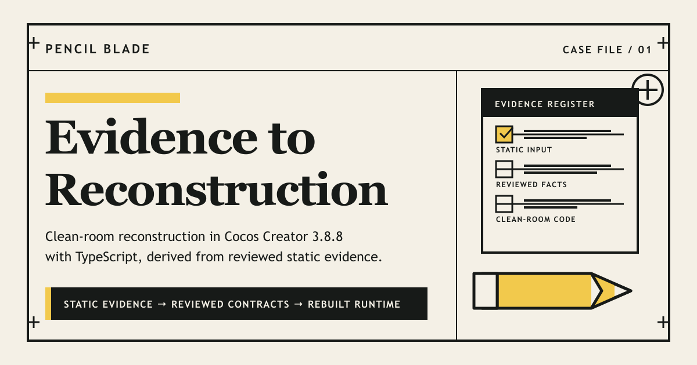
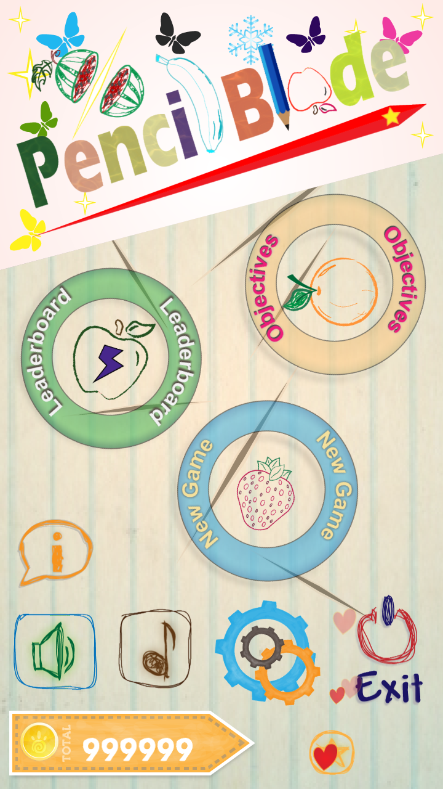
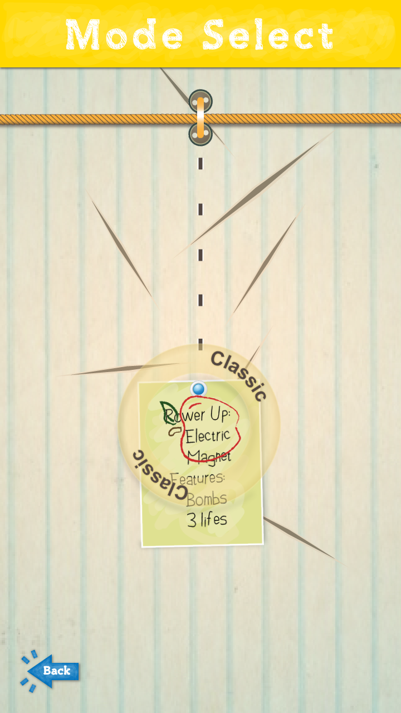
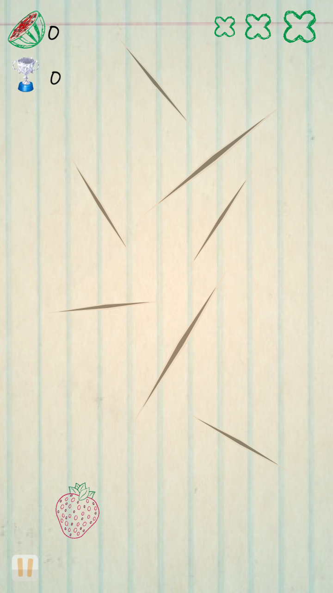
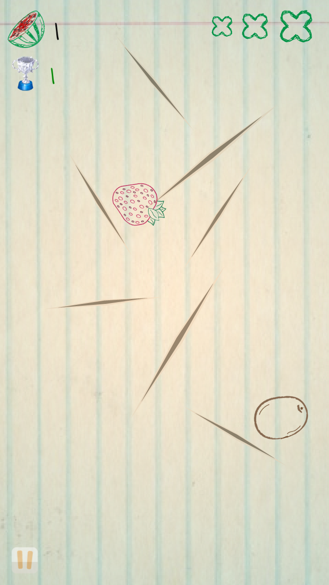

<h1 align="center">Pencil Blade: Reconstructing a Lost Game</h1>

<p align="center">
  
</p>

<p align="center">
  <strong>A non-runnable Android game, reconstructed from static evidence into a playable Cocos Creator project—without executing or embedding the original APK.</strong>
</p>

<p align="center">
  <a href="https://dantech0xff.github.io/pencil-blade-2026/play/"><strong>▶ Play the reconstruction</strong></a>
  &nbsp;·&nbsp;
  <a href="https://dantech0xff.github.io/pencil-blade-2026/forensics/"><strong>Explore the forensics</strong></a>
  &nbsp;·&nbsp;
  <a href="https://dantech0xff.github.io/pencil-blade-2026/vi/">Tiếng Việt</a>
</p>

<p align="center">
  <code>Cocos Creator 3.8.8</code>
  <code>TypeScript</code>
  <code>Web Mobile + Android</code>
  <code>Source-available · Noncommercial</code>
</p>

## Why this project exists

The original *Pencil Blade 1.5* package could not run on the modern Android devices available to this project. Instead of wrapping the old binary in an emulator or guessing from memory, this reconstruction follows a stricter path:

1. **Extract static evidence** from the preserved package and resource inventory.
2. **Recover behavioral contracts** from Java, native, and asset relationships.
3. **Rewrite the game clean-room** in TypeScript, then verify the new Android and Web Mobile runtimes independently.

Every conclusion remains labeled as **recovered**, **inferred**, or **unknown**. The result is a playable reconstruction and a reproducible engineering case study—not a claim of historical-runtime identity.

## Playable reconstruction

<table>
  <tr>
    <td align="center">
      <br>
      <sub><strong>01 · Main Menu</strong></sub>
    </td>
    <td align="center">
      <br>
      <sub><strong>02 · Settled Mode Select</strong></sub>
    </td>
  </tr>
  <tr>
    <td align="center">
      <br>
      <sub><strong>03 · Classic Ready</strong></sub>
    </td>
    <td align="center">
      <br>
      <sub><strong>04 · Slice in Action</strong></sub>
    </td>
  </tr>
</table>

> These are exact-pixel captures from the audited reconstruction H5 build. They are not captures of the original runtime and do not prove pixel-, frame-, or trajectory-level identity with it.

## Evidence, not vibes

| Surface | Reviewed result |
|---|---|
| Native analysis | `713/713` allowlisted application functions enriched with calls, constants, string references, and review state |
| Resource accounting | `862/862` staged assets classified; `761` connected to live runtime consumers |
| Claim ledger | `39` reviewed claims: `38` recovered technical claims and `1` unresolved rights claim |
| Supported outputs | Android debug APK for internal verification and audited Web Mobile H5 |

These denominators describe different evidence surfaces. They are deliberately kept separate and must not be compressed into a “100% restored” claim.

## How the reconstruction is organized

```text
static evidence
    ↓
reviewed contracts + resource ledger
    ↓
clean-room TypeScript implementation
    ↓
Cocos Creator 3.8.8
    ↓
Android debug + Web Mobile H5 verification
```

| Path | What you will find |
|---|---|
| `game/` | Cocos Creator project, TypeScript gameplay, scenes, and the reconstructed resource set |
| `forensics/` | Reviewed claims, native/resource analysis, fidelity records, and runtime observations |
| `scripts/` | Fail-closed audits, data generation, build checks, and capture verification |
| `docs/` | Method, architecture, compatibility, rights, and reconstruction reports |
| `release/` | Separate technical-preservation and public/commercial release decisions |

## Explore locally

The fastest path is the hosted **[Play launcher](https://dantech0xff.github.io/pencil-blade-2026/play/)**. To inspect the repository:

```bash
git clone https://github.com/dantech0xff/pencil-blade-2026.git
cd pencil-blade-2026

# Run the documentary site locally.
npm --prefix site ci
npm --prefix site run dev
```

To inspect the game project, open `game/` with **Cocos Creator 3.8.8**. The repository intentionally does not advertise an unverified one-command Creator build.

## Read the case study

- [Project overview](./docs/project-overview-pdr.md)
- [Reconstruction report](./docs/reconstruction-report.md)
- [System architecture](./docs/system-architecture.md)
- [Compatibility matrix](./docs/compatibility-matrix.md)
- [Release-rights checklist](./docs/release-rights-checklist.md)

## Scope and license

This is an **unofficial, noncommercial, clean-room reconstruction**. It is not affiliated with the original owner, developer, or publisher.

- The original APK was used only as static evidence; it was never executed or embedded in the reconstruction.
- The project does not claim recovered original source or identity with the historical runtime.
- Contributor-owned reconstruction code and documentation are available under the [PolyForm Noncommercial License 1.0.0](./LICENSE). This is source-available, not OSI open source.
- Recovered or third-party artwork, audio, fonts, names, and identity are not licensed merely because they appear in this repository.
- The academic demonstration does not grant commercial rights. Public/commercial release remains blocked pending separate rights clearance.

If evidence-first game preservation, clean-room reconstruction, or Cocos reverse engineering is useful to you, consider starring the repository—it helps more preservation-minded developers find the work.
